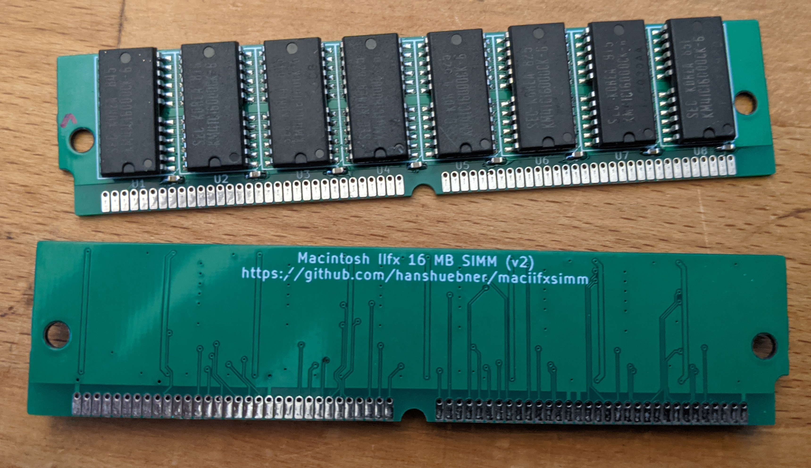

# Macintosh IIfx 16 MB SIMM

This repository contains a PCB layout for a 16MB SIMM to be used in
the Macintosh IIfx system.  The SIMM is a proprietary, 8 bit wide
proprietary type with 64 pins.

This design is to be populated with KM41C16000CK chips.  It has been
developed with [KiCAD](https://www.kicad.org/).  I have successfully
built a set of these and they work fine.

## Acknowledgement

Based on work by TubeTimeUS (https://github.com/schlae/gvpsimm)

## Fabrication Notes

When you send the board out for fabrication, please specify a board
thickness of 1.2mm instead of the more common 1.6mm thickness. This
will ensure that the SIMM will fit correctly in the sockets.

Since the components are packed relatively close together, they can be
difficult to solder by hand. I recommend using a solder stencil and a
reflow process.

## License

This work is licensed under a Creative Commons Attribution-ShareAlike
4.0 International License. See
[https://creativecommons.org/licenses/by-sa/4.0/](https://creativecommons.org/licenses/by-sa/4.0/).

